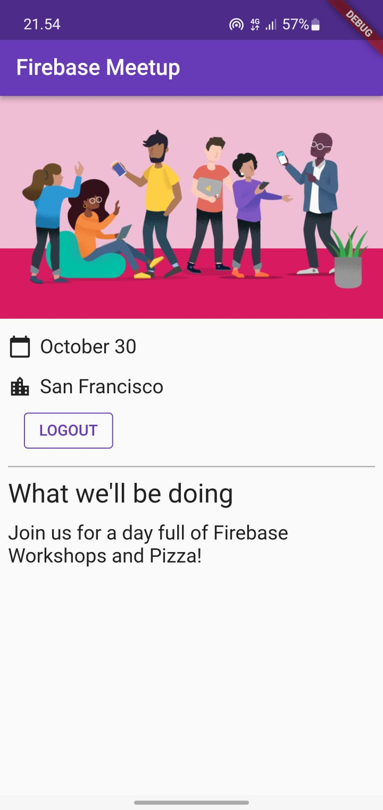

# hello_world

A new Flutter project.

# Langkah ke 1
Menggunakan Kode sempel

# Langkah ke 2
Membuat Cloud Firebase

# Langkah ke 3
Mengistal package pendukung

Mengistal flutterfire cli

1. Menambahkan tempat lokasi hasil instal flutterfire cli kedalam enviroment > path > edit > New > ok
'bertujuan supaya dapat digunakan secara gelobal'

2. Selanjutnya melakukan perintah flutterfire configure untuk mengekstrak informasi, kemudian konfirmasi platform yang akan digunakan

3. Restart PC 

4. lalu lakukan perintah firebase login untuk menghubungkan Cloud dengan project aplikasi

5. Run project menggunakan platform yang telah dipilih pada langkah ke dua

# Langkah ke 4
Berikut Tampilan aplikasi

Berikut Tampilan Penambahan user 

